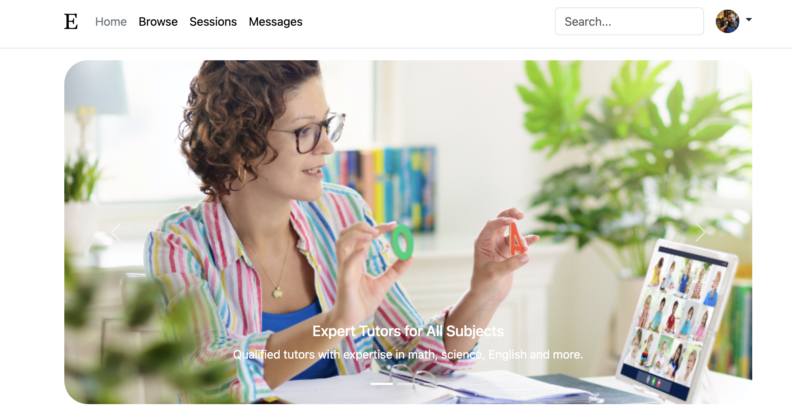

# EduConnect

EduConnect is a project created to practice Bootstrap, inspired by the knowledge gained from Dr. Angela Yu's Udemy course. It serves as a mock service website for online tutoring, designed primarily for practicing Bootstrap concepts. Please note that this project is for design purposes only and is not responsive or interactive.

## Features

- Header Section
- Hero Section with a Carousel
- Main Section
- Pricing Section
- Footer

## Getting Started

To view this project, simply open the HTML file in your preferred web browser. Since it's for design practice and not meant for interaction, no additional setup is required.

## Technologies Used

- Bootstrap

## Acknowledgements

Gratitude to Dr. Angela Yu for her comprehensive Bootstrap course, which provided the foundation for this project.

## Contact Me
If you have any questions, comments, or suggestions, please don't hesitate to reach out. I'd love to hear from you!

**Chaley Boatmon**
- Email: **<u>chaleyboatmon@gmail.com</u>**
- GitHub: [<u>**chayboats**</u>](https://github.com/chayboats)
  
Thank you for visiting my repository!